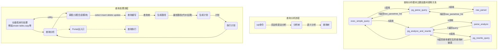

# 查询

```mermaid
flowchart TD; 
subgraph  查询分析模块主要函数间调用关系
snd1(exec_simple_query)--1调用-->snd2(pg_parse_query)
snd2--2调用-->snd3(raw_parser) 
snd3--3返回raw_parsetree_list-->snd2
snd2--4返回raw_parsetree_list-->snd1
snd1--5调用-->snd4(pg_analyze_and_rewrite)
snd4--6调用-->snd5(parse_analyze)
snd5--7返回query-->snd4
snd4-->snd1
snd4--8调用-->snd6(pg_rewrite_query)
snd6--9返回查询重写后的查询树链表-->snd4
end
subgraph  查询分析流程
nd1(sql命令)--词法和语法分析-->nd2(分析树)
nd2--语义分析-->nd3(查询树)
end
subgraph  查询处理流程
id7-->id1
id1(查询分析)-->id2("调度(分配合适模块)")
id2--select insert delete update-->id3(查询重写)
id3--查询树-->id4(生成路径)
id4--"最优路径(代价估算)"-->id5(生成计划)
id5--计划-->id6(执行计划)
id6-->id1
id2--utility-->id7("功能性命令处理 
例如create table,copy等")
id1-.->id8(Portal出入口)
id8-.->id9(查询执行)
end
```

# PG路径生成算法

动态规划算法

遗传算法